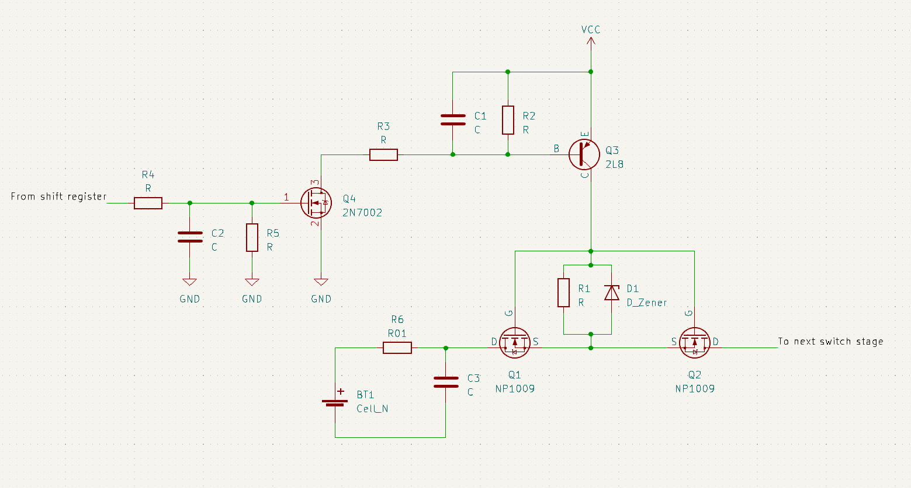
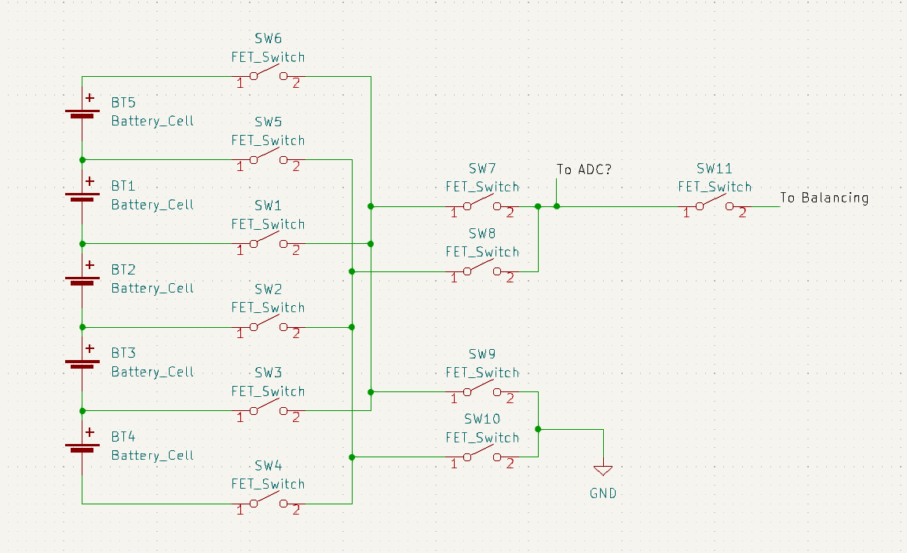
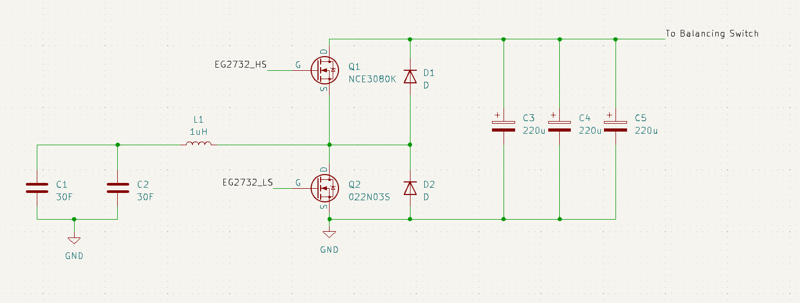

# JK BMS

There are many projects reverse Engineering protocols to interact with a jk-bms in a smart home enviroment.
In contrast, information about the actual hardware are sparse eventhough the active balancing circuit is
quite interesting. This repository attemps to give an overview about the Hardware used inside the BMS.

##Microcontrollers

The Brain of the BMS is a CH32F103C8T6 which is a clone of the popular STM32F103 microcontroller.Probe points are discussed in the next subchapter.
The CH32 is clocked by a 8Mhz quartz

Bluetooth connectivity is provided by a BK3432 Bluetooth SoC in form of a soldered module. There are just a
few connections to the PCB so it can be assumed that the module only handles communication and no other control tasks.

###Testpoinnts
Above the PCB transformer are a few probe points that are used for testing/programming during production
The SWD interface to access the CH32 is on the left side with the following pinout from top to bottom:

|Pin|Function|
|-----------|
|GND | Ground of the CH32, Shift Registers etc.|
|SWDIO | Debugger Data Pin|
|SWCLK | Debugger Clock Pin|
|VCC | most likely 3V3 (not measured yet)|

On the inner side are additional testpoints with no clear function at the time of writing

|Pin|Function|
|-----------|
|Pin 1| Pin 9 Current Sense IC|
|Pin 2| Pin 8 Current Sense IC|
|Pin 3| Connected to the inner Pins of the PCB Trafo (PCB Edge side) and Source of 1N60G N-FET (likely Battery Ground)|
|Pin 4| Pin 4 Current Sense IC|
|Pin 5| Pin 1 Current Sense IC? Vin 3V3 regulator for current sense IC+ Input for Switching converter next to them?|

##Input Stage
Each cell input has a small RC filter with a 10mOhm. This seems to be more like an inrush current limitation and I cant realy see
a reason for this. The capacitors are configured as differential filter capacitors instead of ground referenced ones.
After filtering, the cell inputs are connected to bidirectional MOSFET switches with positive poles of even numbered cells mounted on the top and odd numbered cells on the bottom of the PCB.
Each switch is controled via a chain of four shift registeres near the CH32 microcontroller. Level shifting is achieved by NMOS and PNP based level-shifters. The following Image shows the
reverse-engineered schematic of the input stage for a single cell

The output of all stages on the same side of the PCB are connected together and are feed into a second stage of bidirectional switches. The resulting switching scheme is shown in the following figure:

Via this scheme it is possible to select a single cell that is feed into the balancing circuitry as well as to an ADC for cell voltage measurements.

##Balancing circuitry

The balancing circuitry was the reason to start the reverse engineering in the first place. Its an active balancing method based on transfering charge between cells using supercapacitors as intermediate
energy storages. The capacitors are connected in parallel which results in a capacity of 60F. The basic stage looks like this:

The decision to use different NFETs for high and low side is a bit odd, but seems to be the case. The half bridge configuration
allows operation in either buck mode from a cell into the supercapacitors or in boost mode to transfer energy from the capacitors
to a battery cell. The gates are connected to a EG2732 driver IC, (which seems to be controlled by some comparator based logic?)

##Isolated microcontroller supply

Even more interesting then the balancing circuit is the supply system for the CH32 and Bluetooth SoC. It seems like there is a 
PCB based transformer in use for the galvanic isolation to allow the supply voltage of the microcontroller to float with the cell
voltage that is currently switched to that ground potential. The working principle and control scheme are not clear yet

It looks like there are two switching regulators next to the PCB transformer. The lower one is used to generate the 3V3? supply for the uCs, Shift registers
and EEPROM

##Current Sensing and Low Side Battery Switch

There are THT resistors mounted next to a mosfet which may hint to a soft start/precharge functionality?
There are saveral R001 Resistors which seem to be used as shunts for current measurement
One Side of the bidirectional switches is directly controlled by BAT+

##Power on Button
The Power on Button is powered by the same DCDC powering the current sense IC/co processor and connected to PA1 of the CH32 via an optocoupler for isolation.